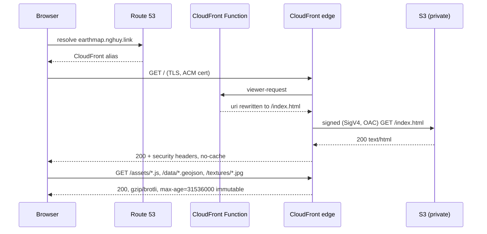
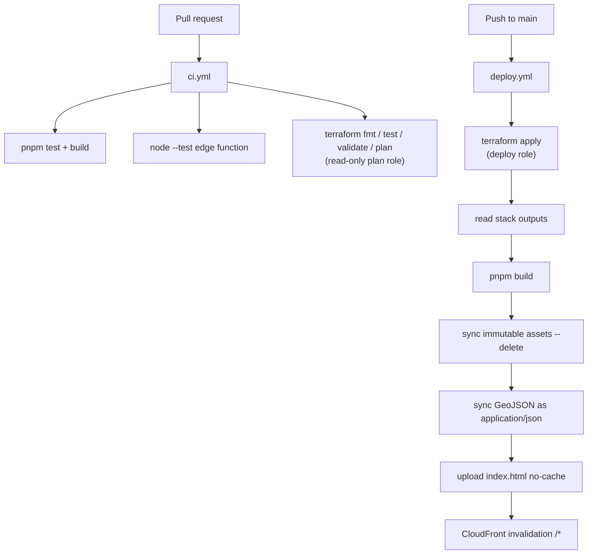

# Deployment architecture

Earth Map is a static application — no API calls, no database, no
authentication. Its "backend" is therefore a delivery stack: object storage
behind a CDN, with all state living in the browser. There is no Lambda or
API Gateway because there is nothing for them to do, and no DynamoDB anywhere
— even Terraform's state lock is an S3 object.

## Services

| Component | Service | Role |
|---|---|---|
| DNS | **Amazon Route 53** | `earthmap.nghuy.link` A/AAAA alias records in the existing `nghuy.link` zone |
| TLS | **AWS Certificate Manager** | DNS-validated certificate in `us-east-1` (a CloudFront requirement) |
| CDN / entry point | **Amazon CloudFront** | Global edge delivery, compression, TLS termination, security headers |
| Edge compute | **CloudFront Functions** | Viewer-request rewrite of extension-less paths to `/index.html` |
| Static hosting | **Amazon S3** | Private bucket in `ap-southeast-1`, reachable only through Origin Access Control |

## Request path



Esri World Imagery tiles are fetched by the browser directly from
`server.arcgisonline.com`; they do not pass through this stack, and the
Content-Security-Policy allows that one host as an image source.

## Caching

| Files | `Cache-Control` | Notes |
|---|---|---|
| `assets/*` | `public,max-age=31536000,immutable` | Vite content-hashes these names |
| `textures/*` | `public,max-age=31536000,immutable` | Already-compressed JPEG/PNG |
| `data/**/*.geojson` | `public,max-age=31536000,immutable` | Uploaded as `application/json` so CloudFront compresses them (~3.5x) |
| `index.html` | `no-cache` | Revalidated every load, so a deploy is live immediately |

Every deploy ends with a `/*` invalidation, so long max-ages never serve stale
content after a release.

## CI/CD



Both workflows authenticate with GitHub OIDC — there are no long-lived AWS
access keys in the repository. The plan role holds `ReadOnlyAccess` only, so a
pull request is structurally incapable of changing infrastructure.

## Terraform layout

State lives in a dedicated S3 bucket with `use_lockfile = true`, so concurrent
applies are serialised by a conditional write on `<key>.tflock` in that same
bucket rather than by a DynamoDB table.

```
infra/
├── bootstrap/                    # one-time, local state: TF state bucket + CI roles
├── modules/
│   ├── acm-certificate/          # us-east-1 cert + DNS validation records
│   └── static-site/              # S3 + OAC + function + headers policy + distribution
│       ├── functions/            # CloudFront Function source and its node:test suite
│       └── tests/                # terraform test, mocked provider, plan-only
└── envs/prod/                    # wires the modules, creates the alias records
```
