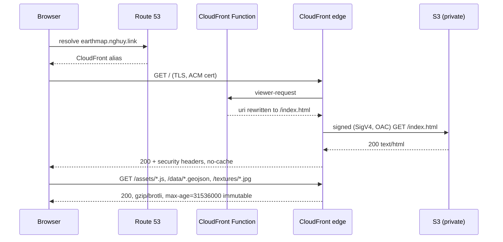
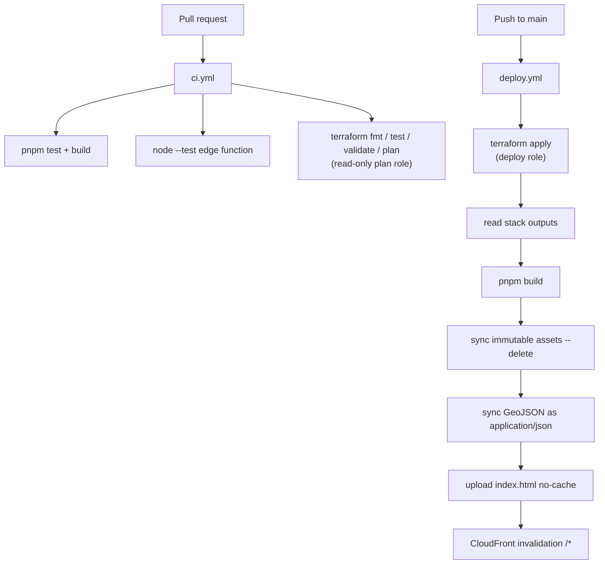

# Earth Map Backend — Serverless Hosting Implementation Plan

> **For agentic workers:** REQUIRED SUB-SKILL: Use superpowers:subagent-driven-development (recommended) or superpowers:executing-plans to implement this plan task-by-task. Steps use checkbox (`- [ ]`) syntax for tracking.

**Goal:** Deploy the existing static Earth Map frontend to `https://earthmap.nghuy.link` on AWS serverless infrastructure, defined entirely in Terraform and shipped by GitHub Actions.

**Architecture:** Route 53 alias → CloudFront distribution (ACM cert in `us-east-1`, a CloudFront Function for URI rewriting, a response-headers policy for security headers) → private S3 bucket reached via Origin Access Control. There is no Lambda, API Gateway, DynamoDB, or Cognito anywhere in this stack: the app makes zero API calls, so any compute or data tier would be dead infrastructure. Terraform state lives in a dedicated S3 bucket using **S3-native locking** (`use_lockfile`), so there is no lock table either; GitHub Actions authenticates via the AWS OIDC provider that already exists in the account.

**Tech Stack:** Terraform >= 1.11 (AWS provider ~> 6.0), AWS (S3, CloudFront, ACM, Route 53, IAM), GitHub Actions with OIDC, Node.js 22 + pnpm 11 for the frontend build, `node:test` for the CloudFront Function unit tests.

## Global Constraints

- **Target domain:** `earthmap.nghuy.link` — exactly this, no other hostnames.
- **AWS account:** `010382427026`. **Primary region:** `ap-southeast-1`. **ACM region:** `us-east-1` (CloudFront requirement, non-negotiable).
- **Existing hosted zone:** `nghuy.link.` → zone ID `Z10168803Q16IBJCR6YRD`. Terraform must **use** this zone, never create it.
- **Existing OIDC provider:** `arn:aws:iam::010382427026:oidc-provider/token.actions.githubusercontent.com` already exists. Reference it with a `data` source. **Never** create `aws_iam_openid_connect_provider` — doing so will fail with `EntityAlreadyExists` and can corrupt other projects' state if imported carelessly.
- **GitHub repo:** `HuyNguyen260398/earth-map`.
- **No new AWS resources are applied during implementation.** Every task ends at `terraform validate` / `terraform plan` / a unit test. `terraform apply` and the push to `main` are the user's to run.
- **Every task ends with its own commit.** One commit per completed task, no batching — the final step of each task is the `git commit` shown there, run only after that task's verification step has passed.
- **No DynamoDB.** State locking uses `use_lockfile = true` (S3 conditional writes). Never add `dynamodb_table` to a backend block or a lock table to bootstrap.
- **`terraform fmt -recursive infra/` must pass** — CI enforces `-check`.
- **`.terraform.lock.hcl` files are committed.** State files, `*.tfvars` (except `*.tfvars.example`), and `.terraform/` directories are not.
- **Naming prefix:** `earth-map` for shared/bootstrap resources, `earth-map-prod` for the prod environment.
- **Commit style:** Conventional Commits (`feat:`, `chore:`, `docs:`, `ci:`), matching the existing history.

## File Structure

| Path | Responsibility |
|---|---|
| `infra/bootstrap/` | One-time, run locally by the user: the Terraform state bucket and the two OIDC-trusted CI IAM roles. Uses **local** state (chicken-and-egg). |
| `infra/modules/acm-certificate/` | Requests a DNS-validated ACM certificate in `us-east-1` and writes its validation records into the existing hosted zone. Sole output: a validated certificate ARN. |
| `infra/modules/static-site/` | Everything that serves bytes: private S3 bucket + hardening, Origin Access Control, the CloudFront Function, the response-headers policy, the distribution, and the bucket policy that ties the bucket to that distribution. |
| `infra/modules/static-site/functions/rewrite-uri.js` | The CloudFront Function source. Plain ES5-compatible script with a global `handler` — **no `export`/`module.exports`**, CloudFront rejects module syntax. |
| `infra/modules/static-site/functions/rewrite-uri.test.mjs` | `node:test` unit tests that load the function source into a `node:vm` sandbox, so the tested artifact is byte-identical to the deployed one. |
| `infra/modules/static-site/tests/plan.tftest.hcl` | `terraform test` plan-only assertions with a mocked AWS provider — runs in CI with no credentials. |
| `infra/envs/prod/` | Wires the two modules together, declares the S3 backend, and creates the A/AAAA alias records. The only root module CI ever runs. |
| `.github/workflows/ci.yml` | Pull requests: frontend test+build, edge-function unit tests, `terraform fmt/validate/plan` under the read-only plan role. |
| `.github/workflows/deploy.yml` | Push to `main`: `terraform apply`, frontend build, three-pass S3 sync, CloudFront invalidation. |
| `docs/architecture.md` | Service table, request-path diagram, and the deploy-pipeline diagram. |
| `README.md` (modify) | New "Deployment" section: prerequisites, bootstrap, GitHub configuration, first deploy, tear-down. |
| `.gitignore` (modify) | Terraform artifacts. |

---

## Task 1: Terraform bootstrap — state backend and CI IAM roles

**Files:**
- Create: `infra/bootstrap/versions.tf`
- Create: `infra/bootstrap/variables.tf`
- Create: `infra/bootstrap/main.tf`
- Create: `infra/bootstrap/outputs.tf`
- Create: `infra/bootstrap/terraform.tfvars.example`
- Modify: `.gitignore`

**Interfaces:**
- Consumes: nothing (first task).
- Produces: an S3 bucket named by `var.state_bucket_name`, and IAM roles `${var.name_prefix}-ci-plan-role` / `${var.name_prefix}-ci-deploy-role`. Task 5's backend block and Tasks 6–7's workflows depend on these exact names. There is **no** lock table — locking is S3-native.

- [ ] **Step 1: Add Terraform artifacts to `.gitignore`**

Append to `/Users/huyng/ws/earth-map/.gitignore`:

```gitignore

# Terraform
**/.terraform/*
*.tfstate
*.tfstate.*
*.tfplan
tfplan
crash.log
crash.*.log
override.tf
override.tf.json
*_override.tf
*_override.tf.json
.terraformrc
terraform.rc
*.tfvars
!*.tfvars.example
```

> `.terraform.lock.hcl` is deliberately **not** ignored — provider checksums must be committed so CI resolves the same provider builds.

- [ ] **Step 2: Write `infra/bootstrap/versions.tf`**

```hcl
terraform {
  # 1.11 is the floor for stable S3-native state locking (use_lockfile), which
  # the prod backend in infra/envs/prod relies on instead of a lock table.
  required_version = ">= 1.11"

  required_providers {
    aws = {
      source  = "hashicorp/aws"
      version = "~> 6.0"
    }
  }
}

provider "aws" {
  region = var.region

  default_tags {
    tags = {
      Project   = "earth-map"
      ManagedBy = "terraform"
      Component = "bootstrap"
    }
  }
}
```

- [ ] **Step 3: Write `infra/bootstrap/variables.tf`**

```hcl
variable "region" {
  description = "Region for the Terraform state bucket and IAM roles."
  type        = string
  default     = "ap-southeast-1"
}

variable "name_prefix" {
  description = "Prefix for bootstrap-created resource names."
  type        = string
  default     = "earth-map"
}

variable "state_bucket_name" {
  description = "Globally unique S3 bucket name for Terraform remote state."
  type        = string
}

variable "site_bucket_name" {
  description = "Name of the site bucket the prod stack will create. Scopes the deploy role's S3 permissions; the bucket need not exist yet."
  type        = string
}

variable "hosted_zone_id" {
  description = "Route 53 hosted zone ID for nghuy.link. Scopes the deploy role's Route 53 permissions."
  type        = string
}

variable "github_owner" {
  description = "GitHub account that owns the repository."
  type        = string
  default     = "HuyNguyen260398"
}

variable "github_repo" {
  description = "GitHub repository name."
  type        = string
  default     = "earth-map"
}
```

- [ ] **Step 4: Write `infra/bootstrap/main.tf`**

```hcl
# The provider already exists in this account (shared with other projects).
# Referencing it here is deliberate: creating it would fail with
# EntityAlreadyExists and risks other stacks' state.
data "aws_iam_openid_connect_provider" "github" {
  url = "https://token.actions.githubusercontent.com"
}

# ---------------------------------------------------------------------------
# Terraform remote state
# ---------------------------------------------------------------------------

resource "aws_s3_bucket" "state" {
  bucket = var.state_bucket_name
}

resource "aws_s3_bucket_versioning" "state" {
  bucket = aws_s3_bucket.state.id

  versioning_configuration {
    status = "Enabled"
  }
}

resource "aws_s3_bucket_server_side_encryption_configuration" "state" {
  bucket = aws_s3_bucket.state.id

  rule {
    apply_server_side_encryption_by_default {
      sse_algorithm = "AES256"
    }
  }
}

resource "aws_s3_bucket_public_access_block" "state" {
  bucket                  = aws_s3_bucket.state.id
  block_public_acls       = true
  block_public_policy     = true
  ignore_public_acls      = true
  restrict_public_buckets = true
}

# No lock table: infra/envs/prod uses S3-native locking (use_lockfile), which
# takes the lock with a conditional PutObject on <key>.tflock in this bucket.

# ---------------------------------------------------------------------------
# GitHub Actions IAM roles
# ---------------------------------------------------------------------------

data "aws_iam_policy_document" "plan_trust" {
  statement {
    effect  = "Allow"
    actions = ["sts:AssumeRoleWithWebIdentity"]

    principals {
      type        = "Federated"
      identifiers = [data.aws_iam_openid_connect_provider.github.arn]
    }

    condition {
      test     = "StringEquals"
      variable = "token.actions.githubusercontent.com:aud"
      values   = ["sts.amazonaws.com"]
    }

    condition {
      test     = "StringEquals"
      variable = "token.actions.githubusercontent.com:sub"
      values   = ["repo:${var.github_owner}/${var.github_repo}:pull_request"]
    }
  }
}

resource "aws_iam_role" "plan" {
  name               = "${var.name_prefix}-ci-plan-role"
  description        = "Read-only role assumed by ci.yml to run terraform plan on pull requests."
  assume_role_policy = data.aws_iam_policy_document.plan_trust.json
}

# ci.yml runs `terraform plan -lock=false`, so this role never needs to write
# the .tflock object — ReadOnlyAccess alone is sufficient and keeps the PR role
# genuinely incapable of changing anything.
resource "aws_iam_role_policy_attachment" "plan_readonly" {
  role       = aws_iam_role.plan.name
  policy_arn = "arn:aws:iam::aws:policy/ReadOnlyAccess"
}

data "aws_iam_policy_document" "deploy_trust" {
  statement {
    effect  = "Allow"
    actions = ["sts:AssumeRoleWithWebIdentity"]

    principals {
      type        = "Federated"
      identifiers = [data.aws_iam_openid_connect_provider.github.arn]
    }

    condition {
      test     = "StringEquals"
      variable = "token.actions.githubusercontent.com:aud"
      values   = ["sts.amazonaws.com"]
    }

    condition {
      test     = "StringEquals"
      variable = "token.actions.githubusercontent.com:sub"
      values   = ["repo:${var.github_owner}/${var.github_repo}:ref:refs/heads/main"]
    }
  }
}

resource "aws_iam_role" "deploy" {
  name               = "${var.name_prefix}-ci-deploy-role"
  description        = "Role assumed by deploy.yml to apply the prod stack and ship the frontend."
  assume_role_policy = data.aws_iam_policy_document.deploy_trust.json
}

data "aws_iam_policy_document" "deploy" {
  # Covers both the state object and the <key>.tflock object that S3-native
  # locking writes and deletes alongside it.
  statement {
    sid    = "TerraformStateAndLock"
    effect = "Allow"

    actions = [
      "s3:ListBucket",
      "s3:GetBucketVersioning",
      "s3:GetObject",
      "s3:PutObject",
      "s3:DeleteObject",
    ]

    resources = [
      "arn:aws:s3:::${var.state_bucket_name}",
      "arn:aws:s3:::${var.state_bucket_name}/*",
    ]
  }

  # The site bucket's full lifecycle: create, configure, sync objects, destroy.
  statement {
    sid       = "SiteBucket"
    effect    = "Allow"
    actions   = ["s3:*"]
    resources = [
      "arn:aws:s3:::${var.site_bucket_name}",
      "arn:aws:s3:::${var.site_bucket_name}/*",
    ]
  }

  # CloudFront supports resource-level permissions for very few of the actions
  # Terraform needs across a distribution/function/policy lifecycle, so this is
  # service-wide by necessity rather than by convenience.
  statement {
    sid       = "CloudFront"
    effect    = "Allow"
    actions   = ["cloudfront:*"]
    resources = ["*"]
  }

  # ACM ARNs are generated at RequestCertificate time and cannot be predicted,
  # so this statement cannot be resource-scoped.
  statement {
    sid    = "Acm"
    effect = "Allow"

    actions = [
      "acm:RequestCertificate",
      "acm:DescribeCertificate",
      "acm:DeleteCertificate",
      "acm:ListCertificates",
      "acm:ListTagsForCertificate",
      "acm:AddTagsToCertificate",
      "acm:RemoveTagsFromCertificate",
    ]

    resources = ["*"]
  }

  statement {
    sid    = "Route53Zone"
    effect = "Allow"

    actions = [
      "route53:GetHostedZone",
      "route53:ListResourceRecordSets",
      "route53:ChangeResourceRecordSets",
    ]

    resources = ["arn:aws:route53:::hostedzone/${var.hosted_zone_id}"]
  }

  statement {
    sid       = "Route53Global"
    effect    = "Allow"
    actions   = ["route53:ListHostedZones", "route53:GetChange"]
    resources = ["*"]
  }
}

resource "aws_iam_role_policy" "deploy" {
  name   = "${var.name_prefix}-ci-deploy-policy"
  role   = aws_iam_role.deploy.id
  policy = data.aws_iam_policy_document.deploy.json
}
```

- [ ] **Step 5: Write `infra/bootstrap/outputs.tf`**

```hcl
output "state_bucket_name" {
  description = "S3 bucket holding Terraform remote state and its .tflock objects. Set as the STATE_BUCKET_NAME GitHub variable."
  value       = aws_s3_bucket.state.id
}

output "plan_role_arn" {
  description = "Set as the AWS_PLAN_ROLE_ARN GitHub secret."
  value       = aws_iam_role.plan.arn
}

output "deploy_role_arn" {
  description = "Set as the AWS_DEPLOY_ROLE_ARN GitHub secret."
  value       = aws_iam_role.deploy.arn
}
```

- [ ] **Step 6: Write `infra/bootstrap/terraform.tfvars.example`**

```hcl
region            = "ap-southeast-1"
state_bucket_name = "earth-map-tfstate-010382427026"
site_bucket_name  = "earth-map-prod-site-010382427026"
hosted_zone_id    = "Z10168803Q16IBJCR6YRD"
github_owner      = "HuyNguyen260398"
github_repo       = "earth-map"
```

- [ ] **Step 7: Verify it initialises, formats and validates**

Run from the repo root:

```bash
terraform -chdir=infra/bootstrap init -backend=false
terraform fmt -check -recursive infra
terraform -chdir=infra/bootstrap validate
```

Expected: `init` reports `Terraform has been successfully initialized!`, `fmt -check` prints nothing and exits 0, `validate` prints `Success! The configuration is valid.`

If `init` fails resolving `hashicorp/aws ~> 6.0`, the major version has moved — check `terraform -chdir=infra/bootstrap providers` output, update the constraint in **every** `versions.tf` this plan creates, and note it in the final report.

- [ ] **Step 8: Commit**

```bash
git add .gitignore infra/bootstrap
git commit -m "feat(infra): bootstrap Terraform state backend and CI OIDC roles"
```

---

## Task 2: CloudFront URI-rewrite function (TDD)

**Files:**
- Create: `infra/modules/static-site/functions/rewrite-uri.test.mjs`
- Create: `infra/modules/static-site/functions/rewrite-uri.js`

**Interfaces:**
- Consumes: nothing.
- Produces: `infra/modules/static-site/functions/rewrite-uri.js`, a script defining a global `handler(event)` that returns a CloudFront request object. Task 4 reads this file with `file("${path.module}/functions/rewrite-uri.js")`.

**Why this exists:** the S3 origin is private and has no website endpoint, so any path that isn't a real key returns an S3 `AccessDenied` rather than the app. The function collapses every extension-less path onto `/index.html` while leaving real asset paths (`/assets/index-GC2_sEKN.js`, `/data/wards/*.geojson`, `/textures/earth-day-8k.jpg`) untouched.

- [ ] **Step 1: Write the failing test**

Create `infra/modules/static-site/functions/rewrite-uri.test.mjs`:

```javascript
import assert from 'node:assert/strict';
import { readFileSync } from 'node:fs';
import { test } from 'node:test';
import vm from 'node:vm';

// The deployed artifact is a bare script with a global `handler` — CloudFront
// rejects module syntax — so it cannot be imported. Evaluating the exact file
// in a sandbox keeps the tested code byte-identical to the deployed code.
const source = readFileSync(new URL('./rewrite-uri.js', import.meta.url), 'utf8');
const sandbox = vm.createContext({});
vm.runInContext(source, sandbox);
const handler = sandbox.handler;

const requestFor = (uri) => ({ request: { uri, method: 'GET', headers: {} } });

test('rewrites the bare root to /index.html', () => {
  assert.equal(handler(requestFor('/')).uri, '/index.html');
});

test('rewrites an extension-less path to /index.html', () => {
  assert.equal(handler(requestFor('/about')).uri, '/index.html');
});

test('rewrites a trailing-slash path to /index.html', () => {
  assert.equal(handler(requestFor('/vietnam/hanoi/')).uri, '/index.html');
});

test('leaves hashed JS assets untouched', () => {
  assert.equal(handler(requestFor('/assets/index-GC2_sEKN.js')).uri, '/assets/index-GC2_sEKN.js');
});

test('leaves nested GeoJSON data untouched', () => {
  const uri = '/data/wards/vietnam-ward-01.geojson';
  assert.equal(handler(requestFor(uri)).uri, uri);
});

test('leaves textures untouched', () => {
  assert.equal(handler(requestFor('/textures/earth-day-8k.jpg')).uri, '/textures/earth-day-8k.jpg');
});

test('is not fooled by a dot in a parent directory', () => {
  assert.equal(handler(requestFor('/v1.2/settings')).uri, '/index.html');
});

test('returns the same request object it was given', () => {
  const event = requestFor('/index.html');
  assert.equal(handler(event), event.request);
});
```

- [ ] **Step 2: Run the test to verify it fails**

```bash
node --test 'infra/modules/static-site/functions/*.test.mjs'
```

Expected: FAIL — `ENOENT: no such file or directory, open '.../rewrite-uri.js'`.

- [ ] **Step 3: Write the minimal implementation**

Create `infra/modules/static-site/functions/rewrite-uri.js`:

```javascript
// CloudFront Function (viewer-request). Runtime: cloudfront-js-2.0.
//
// The S3 origin is private with no website endpoint, so a request for a path
// that is not a real object key returns AccessDenied instead of the app. Any
// path whose final segment has no file extension is therefore served the SPA
// shell; real asset paths pass through unchanged.
//
// Must stay a bare script with a global `handler` — CloudFront rejects
// `export` / `module.exports`. Tested by rewrite-uri.test.mjs via node:vm.
function handler(event) {
    var request = event.request;
    var uri = request.uri;
    var lastSegment = uri.substring(uri.lastIndexOf('/') + 1);

    if (lastSegment.indexOf('.') === -1) {
        request.uri = '/index.html';
    }

    return request;
}
```

- [ ] **Step 4: Run the test to verify it passes**

```bash
node --test 'infra/modules/static-site/functions/*.test.mjs'
```

Expected: PASS — `# pass 8`, `# fail 0`.

- [ ] **Step 5: Commit**

```bash
git add infra/modules/static-site/functions
git commit -m "feat(infra): add CloudFront viewer-request URI rewrite function"
```

---

## Task 3: `acm-certificate` module

**Files:**
- Create: `infra/modules/acm-certificate/versions.tf`
- Create: `infra/modules/acm-certificate/variables.tf`
- Create: `infra/modules/acm-certificate/main.tf`
- Create: `infra/modules/acm-certificate/outputs.tf`

**Interfaces:**
- Consumes: nothing from earlier tasks. Receives an `aws` provider **already configured for `us-east-1`** from its caller.
- Produces: output `certificate_arn` (string) — the ARN of a **validated** certificate, safe to hand straight to `viewer_certificate`. Task 5 passes this to the `static-site` module.

- [ ] **Step 1: Write `infra/modules/acm-certificate/versions.tf`**

The module declares no `provider` block: the caller supplies one via `providers = { aws = aws.us_east_1 }`. Declaring one here would make the module non-composable.

```hcl
terraform {
  required_version = ">= 1.11"

  required_providers {
    aws = {
      source  = "hashicorp/aws"
      version = "~> 6.0"
    }
  }
}
```

- [ ] **Step 2: Write `infra/modules/acm-certificate/variables.tf`**

```hcl
variable "domain_name" {
  description = "Fully qualified domain name the certificate is issued for."
  type        = string
}

variable "hosted_zone_id" {
  description = "Route 53 hosted zone in which DNS validation records are written."
  type        = string
}

variable "tags" {
  description = "Tags applied to the certificate."
  type        = map(string)
  default     = {}
}
```

- [ ] **Step 3: Write `infra/modules/acm-certificate/main.tf`**

```hcl
# CloudFront only accepts viewer certificates from us-east-1; the caller is
# responsible for passing a provider configured for that region.
resource "aws_acm_certificate" "this" {
  domain_name       = var.domain_name
  validation_method = "DNS"
  tags              = var.tags

  # A cert in use by a distribution cannot be deleted, so a change that forces
  # replacement must create the new one before destroying the old.
  lifecycle {
    create_before_destroy = true
  }
}

resource "aws_route53_record" "validation" {
  for_each = {
    for dvo in aws_acm_certificate.this.domain_validation_options :
    dvo.domain_name => {
      name   = dvo.resource_record_name
      record = dvo.resource_record_value
      type   = dvo.resource_record_type
    }
  }

  # The zone is shared with other projects; overwrite rather than fail if a
  # stale validation record for this name is already present.
  allow_overwrite = true
  zone_id         = var.hosted_zone_id
  name            = each.value.name
  type            = each.value.type
  records         = [each.value.record]
  ttl             = 60
}

resource "aws_acm_certificate_validation" "this" {
  certificate_arn         = aws_acm_certificate.this.arn
  validation_record_fqdns = [for record in aws_route53_record.validation : record.fqdn]
}
```

- [ ] **Step 4: Write `infra/modules/acm-certificate/outputs.tf`**

```hcl
output "certificate_arn" {
  description = "ARN of the issued and validated certificate."
  # Sourced from the validation resource, not the certificate, so consumers
  # cannot attach a certificate that ACM has not yet issued.
  value = aws_acm_certificate_validation.this.certificate_arn
}
```

- [ ] **Step 5: Verify**

```bash
terraform -chdir=infra/modules/acm-certificate init -backend=false
terraform fmt -check -recursive infra
terraform -chdir=infra/modules/acm-certificate validate
```

Expected: `Success! The configuration is valid.`

- [ ] **Step 6: Commit**

```bash
git add infra/modules/acm-certificate
git commit -m "feat(infra): add DNS-validated ACM certificate module"
```

---

## Task 4: `static-site` module

**Files:**
- Create: `infra/modules/static-site/versions.tf`
- Create: `infra/modules/static-site/variables.tf`
- Create: `infra/modules/static-site/main.tf`
- Create: `infra/modules/static-site/outputs.tf`
- Create: `infra/modules/static-site/tests/plan.tftest.hcl`
- Uses: `infra/modules/static-site/functions/rewrite-uri.js` (Task 2)

**Interfaces:**
- Consumes: `certificate_arn` from Task 3's `acm-certificate` module output.
- Produces: outputs `bucket_name` (string), `distribution_id` (string), `distribution_domain_name` (string), `distribution_hosted_zone_id` (string). Task 5 builds alias records from the last two; Task 7's deploy workflow reads the first two.

- [ ] **Step 1: Write the failing plan test**

Create `infra/modules/static-site/tests/plan.tftest.hcl`. A mocked provider means this runs in CI with no AWS credentials and touches nothing.

```hcl
mock_provider "aws" {}

variables {
  name_prefix     = "earth-map-prod"
  bucket_name     = "earth-map-prod-site-000000000000"
  domain_name     = "earthmap.nghuy.link"
  certificate_arn = "arn:aws:acm:us-east-1:000000000000:certificate/00000000-0000-0000-0000-000000000000"
}

run "distribution_is_wired_to_the_domain_and_bucket" {
  command = plan

  assert {
    condition     = aws_s3_bucket.site.bucket == "earth-map-prod-site-000000000000"
    error_message = "Site bucket must use the caller-supplied name."
  }

  assert {
    condition     = contains(aws_cloudfront_distribution.site.aliases, "earthmap.nghuy.link")
    error_message = "Distribution must serve the requested domain."
  }

  assert {
    condition     = aws_cloudfront_distribution.site.default_root_object == "index.html"
    error_message = "Root requests must resolve to the SPA shell."
  }

  assert {
    condition     = aws_cloudfront_distribution.site.viewer_certificate[0].minimum_protocol_version == "TLSv1.2_2021"
    error_message = "Viewer TLS floor must be TLSv1.2_2021."
  }
}

run "origin_is_private_and_compressed" {
  command = plan

  assert {
    condition     = aws_s3_bucket_public_access_block.site.block_public_policy
    error_message = "The site bucket must never be publicly reachable."
  }

  assert {
    condition     = aws_cloudfront_distribution.site.default_cache_behavior[0].compress
    error_message = "Compression must be on — GeoJSON is ~3.5x smaller gzipped."
  }

  assert {
    condition     = aws_cloudfront_distribution.site.default_cache_behavior[0].viewer_protocol_policy == "redirect-to-https"
    error_message = "Plain HTTP must be redirected, not served."
  }

  assert {
    condition     = length(aws_cloudfront_distribution.site.default_cache_behavior[0].function_association) == 1
    error_message = "The viewer-request rewrite function must be attached."
  }
}
```

- [ ] **Step 2: Run the test to verify it fails**

```bash
terraform -chdir=infra/modules/static-site init -backend=false && terraform -chdir=infra/modules/static-site test
```

Expected: FAIL — `init` errors because the module has no configuration files yet, or `test` reports the referenced resources do not exist.

- [ ] **Step 3: Write `infra/modules/static-site/versions.tf`**

```hcl
terraform {
  required_version = ">= 1.11"

  required_providers {
    aws = {
      source  = "hashicorp/aws"
      version = "~> 6.0"
    }
  }
}
```

- [ ] **Step 4: Write `infra/modules/static-site/variables.tf`**

The CSP default is derived from what the app actually loads: one external host, `server.arcgisonline.com`, for Esri World Imagery tiles (`frontend/src/globe.ts:17`). Three.js fetches those through ``, hence `img-src`. `style-src 'unsafe-inline'` covers globe.gl's injected tooltip styling.

```hcl
variable "name_prefix" {
  description = "Prefix for CloudFront resource names."
  type        = string
}

variable "bucket_name" {
  description = "Globally unique name for the private origin bucket."
  type        = string
}

variable "domain_name" {
  description = "Alias the distribution serves, e.g. earthmap.nghuy.link."
  type        = string
}

variable "certificate_arn" {
  description = "ARN of a validated us-east-1 ACM certificate covering domain_name."
  type        = string
}

variable "comment" {
  description = "CloudFront distribution comment shown in the console."
  type        = string
  default     = "Earth Map SPA"
}

variable "price_class" {
  description = "CloudFront price class. PriceClass_200 includes South-East Asia, the app's primary audience, without paying for South America and Oceania edges."
  type        = string
  default     = "PriceClass_200"
}

variable "content_security_policy" {
  description = "Content-Security-Policy header value. Esri World Imagery tiles are loaded as images from server.arcgisonline.com; change this in step with frontend/src/globe.ts."
  type        = string
  default     = "default-src 'self'; script-src 'self'; style-src 'self' 'unsafe-inline'; img-src 'self' data: blob: https://server.arcgisonline.com; connect-src 'self'; worker-src 'self' blob:; font-src 'self'; base-uri 'self'; form-action 'none'; frame-ancestors 'none'; object-src 'none'"
}

variable "tags" {
  description = "Tags applied to taggable resources in this module."
  type        = map(string)
  default     = {}
}
```

- [ ] **Step 5: Write `infra/modules/static-site/main.tf`**

```hcl
# ---------------------------------------------------------------------------
# Origin bucket — private, reachable only through CloudFront's OAC
# ---------------------------------------------------------------------------

resource "aws_s3_bucket" "site" {
  bucket = var.bucket_name
  tags   = var.tags
}

resource "aws_s3_bucket_public_access_block" "site" {
  bucket                  = aws_s3_bucket.site.id
  block_public_acls       = true
  block_public_policy     = true
  ignore_public_acls      = true
  restrict_public_buckets = true
}

resource "aws_s3_bucket_ownership_controls" "site" {
  bucket = aws_s3_bucket.site.id

  rule {
    object_ownership = "BucketOwnerEnforced"
  }
}

resource "aws_s3_bucket_server_side_encryption_configuration" "site" {
  bucket = aws_s3_bucket.site.id

  rule {
    apply_server_side_encryption_by_default {
      sse_algorithm = "AES256"
    }
  }
}

# ---------------------------------------------------------------------------
# Edge configuration
# ---------------------------------------------------------------------------

resource "aws_cloudfront_origin_access_control" "site" {
  name                              = "${var.name_prefix}-oac"
  description                       = "SigV4 access from CloudFront to the private site bucket"
  origin_access_control_origin_type = "s3"
  signing_behavior                  = "always"
  signing_protocol                  = "sigv4"
}

resource "aws_cloudfront_function" "rewrite_uri" {
  name    = "${var.name_prefix}-rewrite-uri"
  runtime = "cloudfront-js-2.0"
  comment = "Serve the SPA shell for extension-less paths"
  publish = true
  code    = file("${path.module}/functions/rewrite-uri.js")
}

# Security headers live in a native policy rather than in the function: no
# per-request cost, declarative, and impossible to break with a JS typo.
resource "aws_cloudfront_response_headers_policy" "site" {
  name    = "${var.name_prefix}-security-headers"
  comment = "Security headers for ${var.domain_name}"

  security_headers_config {
    strict_transport_security {
      access_control_max_age_sec = 63072000
      include_subdomains         = true
      preload                    = true
      override                   = true
    }

    content_type_options {
      override = true
    }

    frame_options {
      frame_option = "DENY"
      override     = true
    }

    referrer_policy {
      referrer_policy = "strict-origin-when-cross-origin"
      override        = true
    }

    content_security_policy {
      content_security_policy = var.content_security_policy
      override                = true
    }
  }
}

# Managed-CachingOptimized forwards no cookies/headers/query strings and
# honours the origin's Cache-Control, which is what the deploy workflow sets
# per file class. It also enables gzip and brotli negotiation.
data "aws_cloudfront_cache_policy" "optimized" {
  name = "Managed-CachingOptimized"
}

resource "aws_cloudfront_distribution" "site" {
  enabled             = true
  is_ipv6_enabled     = true
  comment             = var.comment
  default_root_object = "index.html"
  aliases             = [var.domain_name]
  price_class         = var.price_class
  http_version        = "http2and3"
  tags                = var.tags

  origin {
    domain_name              = aws_s3_bucket.site.bucket_regional_domain_name
    origin_id                = "s3-${aws_s3_bucket.site.id}"
    origin_access_control_id = aws_cloudfront_origin_access_control.site.id
  }

  default_cache_behavior {
    target_origin_id       = "s3-${aws_s3_bucket.site.id}"
    viewer_protocol_policy = "redirect-to-https"
    allowed_methods        = ["GET", "HEAD", "OPTIONS"]
    cached_methods         = ["GET", "HEAD"]
    compress               = true

    cache_policy_id            = data.aws_cloudfront_cache_policy.optimized.id
    response_headers_policy_id = aws_cloudfront_response_headers_policy.site.id

    function_association {
      event_type   = "viewer-request"
      function_arn = aws_cloudfront_function.rewrite_uri.arn
    }
  }

  restrictions {
    geo_restriction {
      restriction_type = "none"
    }
  }

  viewer_certificate {
    acm_certificate_arn      = var.certificate_arn
    ssl_support_method       = "sni-only"
    minimum_protocol_version = "TLSv1.2_2021"
  }
}

# ---------------------------------------------------------------------------
# Bucket policy — declared last so it can name the distribution it trusts.
# bucket -> distribution -> policy is acyclic.
# ---------------------------------------------------------------------------

data "aws_iam_policy_document" "site" {
  statement {
    sid       = "AllowCloudFrontServicePrincipalReadOnly"
    effect    = "Allow"
    actions   = ["s3:GetObject"]
    resources = ["${aws_s3_bucket.site.arn}/*"]

    principals {
      type        = "Service"
      identifiers = ["cloudfront.amazonaws.com"]
    }

    condition {
      test     = "StringEquals"
      variable = "AWS:SourceArn"
      values   = [aws_cloudfront_distribution.site.arn]
    }
  }
}

resource "aws_s3_bucket_policy" "site" {
  bucket = aws_s3_bucket.site.id
  policy = data.aws_iam_policy_document.site.json

  depends_on = [aws_s3_bucket_public_access_block.site]
}
```

- [ ] **Step 6: Write `infra/modules/static-site/outputs.tf`**

```hcl
output "bucket_name" {
  description = "Name of the private origin bucket the deploy workflow syncs into."
  value       = aws_s3_bucket.site.id
}

output "distribution_id" {
  description = "CloudFront distribution ID, used to create cache invalidations."
  value       = aws_cloudfront_distribution.site.id
}

output "distribution_domain_name" {
  description = "The *.cloudfront.net domain, used as the Route 53 alias target."
  value       = aws_cloudfront_distribution.site.domain_name
}

output "distribution_hosted_zone_id" {
  description = "CloudFront's fixed hosted zone ID, required by Route 53 alias records."
  value       = aws_cloudfront_distribution.site.hosted_zone_id
}
```

- [ ] **Step 7: Run the tests to verify they pass**

```bash
terraform -chdir=infra/modules/static-site init -backend=false
terraform fmt -check -recursive infra
terraform -chdir=infra/modules/static-site validate
terraform -chdir=infra/modules/static-site test
node --test 'infra/modules/static-site/functions/*.test.mjs'
```

Expected: `validate` prints `Success!`; `test` prints `2 passed, 0 failed`; `node --test` still prints `# fail 0`.

- [ ] **Step 8: Commit**

```bash
git add infra/modules/static-site
git commit -m "feat(infra): add static-site module with private S3 origin behind CloudFront"
```

---

## Task 5: `envs/prod` root module

**Files:**
- Create: `infra/envs/prod/versions.tf`
- Create: `infra/envs/prod/variables.tf`
- Create: `infra/envs/prod/main.tf`
- Create: `infra/envs/prod/outputs.tf`
- Create: `infra/envs/prod/terraform.tfvars.example`

**Interfaces:**
- Consumes: `module.certificate.certificate_arn` (Task 3), and all four `module.site` outputs (Task 4).
- Produces: root outputs `site_bucket_name`, `distribution_id`, `site_url`. Task 7's deploy workflow reads exactly these three names via `terraform output -raw`.

- [ ] **Step 1: Write `infra/envs/prod/versions.tf`**

The backend is deliberately partially configured — bucket and region come from `-backend-config` flags so the same code works from CI and from a laptop.

```hcl
terraform {
  # 1.11 is the floor for stable S3-native state locking (use_lockfile).
  required_version = ">= 1.11"

  required_providers {
    aws = {
      source  = "hashicorp/aws"
      version = "~> 6.0"
    }
  }

  # Partial configuration: supply bucket / region via -backend-config at init
  # time. See README "Deployment".
  #
  # use_lockfile takes the state lock with a conditional PutObject on
  # <key>.tflock in the same bucket — no DynamoDB table, and no deprecated
  # `dynamodb_table` argument.
  backend "s3" {
    key          = "earth-map/prod/terraform.tfstate"
    encrypt      = true
    use_lockfile = true
  }
}

provider "aws" {
  region = var.region

  default_tags {
    tags = local.tags
  }
}

# CloudFront viewer certificates must live in us-east-1 regardless of where
# the rest of the stack runs.
provider "aws" {
  alias  = "us_east_1"
  region = "us-east-1"

  default_tags {
    tags = local.tags
  }
}
```

- [ ] **Step 2: Write `infra/envs/prod/variables.tf`**

```hcl
variable "region" {
  description = "Region for the origin bucket and Terraform state."
  type        = string
  default     = "ap-southeast-1"
}

variable "domain_name" {
  description = "Public hostname the site is served from."
  type        = string
  default     = "earthmap.nghuy.link"
}

variable "hosted_zone_id" {
  description = "Route 53 hosted zone ID for nghuy.link."
  type        = string
}

variable "site_bucket_name" {
  description = "Globally unique name for the origin bucket."
  type        = string
}

variable "name_prefix" {
  description = "Prefix for resource names in this environment."
  type        = string
  default     = "earth-map-prod"
}

variable "price_class" {
  description = "CloudFront price class."
  type        = string
  default     = "PriceClass_200"
}
```

- [ ] **Step 3: Write `infra/envs/prod/main.tf`**

```hcl
locals {
  tags = {
    Project     = "earth-map"
    Environment = "prod"
    ManagedBy   = "terraform"
  }
}

module "certificate" {
  source = "../../modules/acm-certificate"

  providers = {
    aws = aws.us_east_1
  }

  domain_name    = var.domain_name
  hosted_zone_id = var.hosted_zone_id
  tags           = local.tags
}

module "site" {
  source = "../../modules/static-site"

  name_prefix     = var.name_prefix
  bucket_name     = var.site_bucket_name
  domain_name     = var.domain_name
  certificate_arn = module.certificate.certificate_arn
  comment         = "Earth Map SPA — production (${var.domain_name})"
  price_class     = var.price_class
  tags            = local.tags
}

# Alias records live here rather than in a module: two resources, and keeping
# them beside the module call makes the dependency on the distribution obvious.
resource "aws_route53_record" "ipv4" {
  zone_id = var.hosted_zone_id
  name    = var.domain_name
  type    = "A"

  alias {
    name                   = module.site.distribution_domain_name
    zone_id                = module.site.distribution_hosted_zone_id
    evaluate_target_health = false
  }
}

resource "aws_route53_record" "ipv6" {
  zone_id = var.hosted_zone_id
  name    = var.domain_name
  type    = "AAAA"

  alias {
    name                   = module.site.distribution_domain_name
    zone_id                = module.site.distribution_hosted_zone_id
    evaluate_target_health = false
  }
}
```

- [ ] **Step 4: Write `infra/envs/prod/outputs.tf`**

```hcl
output "site_bucket_name" {
  description = "Origin bucket the deploy workflow syncs the build into."
  value       = module.site.bucket_name
}

output "distribution_id" {
  description = "Distribution the deploy workflow invalidates after a sync."
  value       = module.site.distribution_id
}

output "site_url" {
  description = "Public URL of the deployed app."
  value       = "https://${var.domain_name}"
}
```

- [ ] **Step 5: Write `infra/envs/prod/terraform.tfvars.example`**

```hcl
region           = "ap-southeast-1"
domain_name      = "earthmap.nghuy.link"
hosted_zone_id   = "Z10168803Q16IBJCR6YRD"
site_bucket_name = "earth-map-prod-site-010382427026"
```

- [ ] **Step 6: Verify**

`init -backend=false` is used so this passes with no AWS credentials; CI and the user run the real backend init.

```bash
terraform -chdir=infra/envs/prod init -backend=false
terraform fmt -check -recursive infra
terraform -chdir=infra/envs/prod validate
```

Expected: `Success! The configuration is valid.`

If `validate` complains about an unset `hosted_zone_id` or `site_bucket_name`, that is a bug in this task — `validate` must not require variable values. Check that neither is referenced from a `provider` or `backend` block.

- [ ] **Step 7: Commit**

```bash
git add infra/envs/prod
git commit -m "feat(infra): add prod environment for earthmap.nghuy.link"
```

---

## Task 6: `ci.yml` — pull request checks

**Files:**
- Create: `.github/workflows/ci.yml`

**Interfaces:**
- Consumes: repository variables `AWS_REGION`, `STATE_BUCKET_NAME`, `SITE_BUCKET_NAME`, `HOSTED_ZONE_ID`; repository secret `AWS_PLAN_ROLE_ARN`. All are created by the user following the README from Task 8.
- Produces: nothing consumed by later tasks.

- [ ] **Step 1: Write `.github/workflows/ci.yml`**

```yaml
name: CI

on:
  pull_request:
  workflow_dispatch:

permissions:
  contents: read

concurrency:
  group: ci-${{ github.ref }}
  cancel-in-progress: true

jobs:
  frontend:
    name: Frontend test and build
    runs-on: ubuntu-latest
    defaults:
      run:
        working-directory: frontend
    steps:
      - uses: actions/checkout@v5

      - uses: pnpm/action-setup@v4
        with:
          version: 11

      - uses: actions/setup-node@v5
        with:
          node-version: 22
          cache: pnpm
          cache-dependency-path: frontend/pnpm-lock.yaml

      - run: pnpm install --frozen-lockfile
      - run: pnpm test
      - run: pnpm build

  edge-function:
    name: CloudFront function tests
    runs-on: ubuntu-latest
    steps:
      - uses: actions/checkout@v5

      - uses: actions/setup-node@v5
        with:
          node-version: 22

      - run: node --test 'infra/modules/static-site/functions/*.test.mjs'

  terraform:
    name: Terraform
    runs-on: ubuntu-latest
    permissions:
      contents: read
      id-token: write
    steps:
      - uses: actions/checkout@v5

      - uses: hashicorp/setup-terraform@v3
        with:
          terraform_version: 1.15.5
          terraform_wrapper: false

      - name: Check formatting
        run: terraform fmt -check -recursive infra

      # Module-level plan tests use a mocked provider, so they need no
      # credentials and run on every PR.
      - name: Test static-site module
        working-directory: infra/modules/static-site
        run: |
          terraform init -backend=false
          terraform test

      # Also credential-free. Catches configuration errors on every PR,
      # including before the AWS account has been bootstrapped.
      - name: Validate prod
        working-directory: infra/envs/prod
        run: |
          terraform init -backend=false
          terraform validate

      # Everything below needs a bootstrapped account. Until the repository
      # variables and the plan role exist, skip rather than fail: the checks
      # above still gate the PR, and a missing aws-region would otherwise make
      # every pull request red for a reason that is not the PR's fault.
      - name: Check deployment configuration
        id: config
        env:
          AWS_REGION: ${{ vars.AWS_REGION }}
          STATE_BUCKET_NAME: ${{ vars.STATE_BUCKET_NAME }}
          PLAN_ROLE_ARN: ${{ secrets.AWS_PLAN_ROLE_ARN }}
        run: |
          if [ -n "$AWS_REGION" ] && [ -n "$STATE_BUCKET_NAME" ] && [ -n "$PLAN_ROLE_ARN" ]; then
            echo "ready=true" >> "$GITHUB_OUTPUT"
          else
            echo "ready=false" >> "$GITHUB_OUTPUT"
            echo "::notice::Skipping terraform plan — run infra/bootstrap, then set the AWS_REGION, STATE_BUCKET_NAME, SITE_BUCKET_NAME and HOSTED_ZONE_ID variables and the AWS_PLAN_ROLE_ARN secret. See README 'Deployment'."
          fi

      - uses: aws-actions/configure-aws-credentials@v5
        if: steps.config.outputs.ready == 'true'
        with:
          role-to-assume: ${{ secrets.AWS_PLAN_ROLE_ARN }}
          aws-region: ${{ vars.AWS_REGION }}

      # -reconfigure because the validate step above already initialised this
      # directory with -backend=false.
      - name: Init prod with remote state
        if: steps.config.outputs.ready == 'true'
        working-directory: infra/envs/prod
        run: |
          terraform init -input=false -reconfigure \
            -backend-config="bucket=${{ vars.STATE_BUCKET_NAME }}" \
            -backend-config="region=${{ vars.AWS_REGION }}"

      # -lock=false keeps the plan role genuinely read-only: writing the
      # .tflock object needs s3:PutObject, which it deliberately does not have.
      - name: Plan prod
        if: steps.config.outputs.ready == 'true'
        working-directory: infra/envs/prod
        # `shell: bash` runs with -o pipefail. Without it the step's exit status
        # would be tee's, and a failing plan would be reported as success.
        shell: bash
        run: |
          terraform plan -input=false -no-color -lock=false \
            -var="region=${{ vars.AWS_REGION }}" \
            -var="hosted_zone_id=${{ vars.HOSTED_ZONE_ID }}" \
            -var="site_bucket_name=${{ vars.SITE_BUCKET_NAME }}" \
            | tee plan.txt

      - name: Publish plan to job summary
        if: always() && steps.config.outputs.ready == 'true'
        working-directory: infra/envs/prod
        run: |
          {
            echo '## Terraform plan — envs/prod'
            echo
            if [ -s plan.txt ]; then
              echo '```terraform'
              tail -c 60000 plan.txt
              echo '```'
            else
              echo '_The plan produced no output — see the job log for the failure._'
            fi
          } >> "$GITHUB_STEP_SUMMARY"
```

> The plan is published to the job summary rather than a PR comment: no
> `pull-requests: write` permission, no third-party action, and it works
> identically on `workflow_dispatch`.
>
> The credential-gated steps are skipped rather than failed when the repository
> has not been configured yet. `fmt`, the module tests and `validate` all run
> without AWS, so a pull request opened before `infra/bootstrap` has been
> applied is still meaningfully checked instead of being red by default.

- [ ] **Step 2: Verify the workflow parses**

```bash
python3 -c "import yaml,sys; yaml.safe_load(open('.github/workflows/ci.yml')); print('ci.yml: valid YAML')"
```

Expected: `ci.yml: valid YAML`

- [ ] **Step 3: Verify every referenced path exists**

```bash
test -f frontend/package.json \
  && test -d infra/modules/static-site/functions \
  && test -d infra/envs/prod \
  && echo "all referenced paths exist"
```

Expected: `all referenced paths exist`

- [ ] **Step 4: Commit**

```bash
git add .github/workflows/ci.yml
git commit -m "ci: add pull request checks for frontend, edge function and terraform"
```

---

## Task 7: `deploy.yml` — apply and ship

**Files:**
- Create: `.github/workflows/deploy.yml`

**Interfaces:**
- Consumes: `terraform output -raw site_bucket_name` / `distribution_id` / `site_url` from Task 5; repository variables `AWS_REGION`, `STATE_BUCKET_NAME`, `SITE_BUCKET_NAME`, `HOSTED_ZONE_ID`; secret `AWS_DEPLOY_ROLE_ARN`.
- Produces: nothing consumed by later tasks.

- [ ] **Step 1: Write `.github/workflows/deploy.yml`**

```yaml
name: Deploy

on:
  push:
    branches: [main]
    paths-ignore:
      - '**/*.md'
      - 'docs/**'
      - 'LICENSE.md'
  workflow_dispatch:

permissions:
  contents: read
  id-token: write

# Never cancel an in-flight apply: a half-applied stack with a released lock
# is worse than a queued run.
concurrency:
  group: deploy-prod
  cancel-in-progress: false

jobs:
  deploy:
    name: Apply infrastructure and ship the frontend
    runs-on: ubuntu-latest
    steps:
      - uses: actions/checkout@v5

      - uses: aws-actions/configure-aws-credentials@v5
        with:
          role-to-assume: ${{ secrets.AWS_DEPLOY_ROLE_ARN }}
          aws-region: ${{ vars.AWS_REGION }}

      - uses: hashicorp/setup-terraform@v3
        with:
          terraform_version: 1.15.5
          terraform_wrapper: false

      - name: Terraform init
        working-directory: infra/envs/prod
        run: |
          terraform init -input=false \
            -backend-config="bucket=${{ vars.STATE_BUCKET_NAME }}" \
            -backend-config="region=${{ vars.AWS_REGION }}"

      - name: Terraform apply
        working-directory: infra/envs/prod
        run: |
          terraform apply -input=false -auto-approve \
            -var="region=${{ vars.AWS_REGION }}" \
            -var="hosted_zone_id=${{ vars.HOSTED_ZONE_ID }}" \
            -var="site_bucket_name=${{ vars.SITE_BUCKET_NAME }}"

      # Assign before echoing: with `set -e`, a failed command substitution in
      # an assignment aborts the step, whereas one inside `echo` would quietly
      # write an empty value and let the sync run against "s3:///".
      - name: Capture stack outputs
        id: tf
        working-directory: infra/envs/prod
        shell: bash
        run: |
          set -euo pipefail
          site_bucket="$(terraform output -raw site_bucket_name)"
          distribution_id="$(terraform output -raw distribution_id)"
          site_url="$(terraform output -raw site_url)"
          {
            echo "site_bucket=$site_bucket"
            echo "distribution_id=$distribution_id"
            echo "site_url=$site_url"
          } >> "$GITHUB_OUTPUT"

      - uses: pnpm/action-setup@v4
        with:
          version: 11

      - uses: actions/setup-node@v5
        with:
          node-version: 22
          cache: pnpm
          cache-dependency-path: frontend/pnpm-lock.yaml

      - name: Build frontend
        working-directory: frontend
        run: |
          pnpm install --frozen-lockfile
          pnpm build

      # Pass 1 carries --delete and prunes anything no longer in the build.
      # Its --exclude filters apply to the destination listing too, so the
      # GeoJSON and index.html handled by passes 2 and 3 are NOT deleted here.
      # Do not "simplify" this by dropping the excludes.
      - name: Sync immutable assets
        run: |
          aws s3 sync frontend/dist/ "s3://${{ steps.tf.outputs.site_bucket }}/" \
            --delete \
            --exclude "index.html" \
            --exclude "*.geojson" \
            --cache-control "public,max-age=31536000,immutable"

      # aws s3 sync types .geojson as application/octet-stream, which CloudFront
      # refuses to compress — that is ~10 MB shipped raw instead of ~3 MB.
      # Forcing application/json is what makes compression kick in.
      - name: Sync GeoJSON with a compressible content type
        run: |
          aws s3 sync frontend/dist/ "s3://${{ steps.tf.outputs.site_bucket }}/" \
            --exclude "*" \
            --include "*.geojson" \
            --content-type "application/json" \
            --cache-control "public,max-age=31536000,immutable"

      - name: Upload index.html without caching
        run: |
          aws s3 cp frontend/dist/index.html "s3://${{ steps.tf.outputs.site_bucket }}/index.html" \
            --cache-control "no-cache" \
            --content-type "text/html; charset=utf-8"

      # A single "/*" counts as one invalidation path, staying inside the
      # 1000/month free allowance.
      - name: Invalidate CloudFront
        run: |
          aws cloudfront create-invalidation \
            --distribution-id "${{ steps.tf.outputs.distribution_id }}" \
            --paths "/*"

      - name: Report
        run: |
          echo "### Deployed :rocket:" >> "$GITHUB_STEP_SUMMARY"
          echo "" >> "$GITHUB_STEP_SUMMARY"
          echo "${{ steps.tf.outputs.site_url }}" >> "$GITHUB_STEP_SUMMARY"
```

- [ ] **Step 2: Verify the workflow parses**

```bash
python3 -c "import yaml,sys; yaml.safe_load(open('.github/workflows/deploy.yml')); print('deploy.yml: valid YAML')"
```

Expected: `deploy.yml: valid YAML`

- [ ] **Step 3: Verify the output names match Task 5 exactly**

```bash
for name in site_bucket_name distribution_id site_url; do
  grep -q "output \"$name\"" infra/envs/prod/outputs.tf \
    && grep -q "terraform output -raw $name" .github/workflows/deploy.yml \
    && echo "$name: matched"
done
```

Expected: three lines, `site_bucket_name: matched`, `distribution_id: matched`, `site_url: matched`.

- [ ] **Step 4: Commit**

```bash
git add .github/workflows/deploy.yml
git commit -m "ci: add deploy workflow for terraform apply and frontend release"
```

---

## Task 8: Documentation

**Files:**
- Create: `docs/architecture.md`
- Modify: `README.md` (add a Deployment section before "Documentation"; extend "Repository layout" and "Documentation")

**Interfaces:**
- Consumes: every resource name, variable and output defined in Tasks 1–7.
- Produces: nothing consumed by later tasks.

- [ ] **Step 1: Write `docs/architecture.md`**

```markdown
# Deployment architecture

Earth Map is a static application — no API calls, no database, no
authentication. Its "backend" is therefore a delivery stack: object storage
behind a CDN, with all state living in the browser. There is no Lambda or
API Gateway because there is nothing for them to do, and no DynamoDB anywhere
— even Terraform's state lock is an S3 object.

## Services

| Component | Service | Role |
|---|---|---|
| DNS | **Amazon Route 53** | `earthmap.nghuy.link` A/AAAA alias records in the existing `nghuy.link` zone |
| TLS | **AWS Certificate Manager** | DNS-validated certificate in `us-east-1` (a CloudFront requirement) |
| CDN / entry point | **Amazon CloudFront** | Global edge delivery, compression, TLS termination, security headers |
| Edge compute | **CloudFront Functions** | Viewer-request rewrite of extension-less paths to `/index.html` |
| Static hosting | **Amazon S3** | Private bucket in `ap-southeast-1`, reachable only through Origin Access Control |

## Request path



Esri World Imagery tiles are fetched by the browser directly from
`server.arcgisonline.com`; they do not pass through this stack, and the
Content-Security-Policy allows that one host as an image source.

## Caching

| Files | `Cache-Control` | Notes |
|---|---|---|
| `assets/*` | `public,max-age=31536000,immutable` | Vite content-hashes these names |
| `textures/*` | `public,max-age=31536000,immutable` | Already-compressed JPEG/PNG |
| `data/**/*.geojson` | `public,max-age=31536000,immutable` | Uploaded as `application/json` so CloudFront compresses them (~3.5x) |
| `index.html` | `no-cache` | Revalidated every load, so a deploy is live immediately |

Every deploy ends with a `/*` invalidation, so long max-ages never serve stale
content after a release.

## CI/CD



Both workflows authenticate with GitHub OIDC — there are no long-lived AWS
access keys in the repository. The plan role holds `ReadOnlyAccess` only, so a
pull request is structurally incapable of changing infrastructure.

## Terraform layout

State lives in a dedicated S3 bucket with `use_lockfile = true`, so concurrent
applies are serialised by a conditional write on `<key>.tflock` in that same
bucket rather than by a DynamoDB table.

```
infra/
├── bootstrap/                    # one-time, local state: TF state bucket + CI roles
├── modules/
│   ├── acm-certificate/          # us-east-1 cert + DNS validation records
│   └── static-site/              # S3 + OAC + function + headers policy + distribution
│       ├── functions/            # CloudFront Function source and its node:test suite
│       └── tests/                # terraform test, mocked provider, plan-only
└── envs/prod/                    # wires the modules, creates the alias records
```
```

- [ ] **Step 2: Add the Deployment section to `README.md`**

Insert immediately **before** the existing `## Documentation` heading:

````markdown
## Deployment

The app is served from `https://earthmap.nghuy.link` — a private S3 bucket
behind CloudFront, defined in Terraform and shipped by GitHub Actions. See
[`docs/architecture.md`](docs/architecture.md) for the full picture.

> [!WARNING]
> Deploying creates real, billable AWS resources (CloudFront, S3, Route 53
> queries). Traffic to a personal site keeps this to a few dollars a month, but
> it is not free. See [Tear down](#tear-down) below.

### Prerequisites

| Tool | Version |
|---|---|
| Terraform | >= 1.11 (for S3-native state locking) |
| AWS CLI | v2, authenticated to the target account |
| Node.js | 22.x |
| pnpm | 11.x |
| GitHub CLI | optional, for the `gh` commands below |

You also need a Route 53 hosted zone for the parent domain and permission to
create S3 buckets, CloudFront distributions, ACM certificates and IAM roles.

### 1. Bootstrap (once)

Creates the Terraform state bucket and the two OIDC-trusted CI roles. This step
uses local state — it is the chicken-and-egg that everything else stands on.
There is no lock table: `infra/envs/prod` locks with an S3 object
(`use_lockfile`), so the state bucket is the whole backend.

```sh
cd infra/bootstrap
cp terraform.tfvars.example terraform.tfvars   # edit the values
terraform init
terraform apply
```

The account's GitHub OIDC provider is referenced, not created — if the account
does not have one yet, create it first:

```sh
aws iam create-open-id-connect-provider \
  --url "https://token.actions.githubusercontent.com" \
  --client-id-list "sts.amazonaws.com"
```

Note the three outputs; they become the GitHub configuration in the next step.

### 2. Configure the GitHub repository

**Variables:**

| Name | Value |
|---|---|
| `AWS_REGION` | `ap-southeast-1` |
| `STATE_BUCKET_NAME` | `terraform output state_bucket_name` |
| `SITE_BUCKET_NAME` | the `site_bucket_name` you set in `terraform.tfvars` |
| `HOSTED_ZONE_ID` | the hosted zone ID for the parent domain |

**Secrets:**

| Name | Value |
|---|---|
| `AWS_PLAN_ROLE_ARN` | `terraform output plan_role_arn` |
| `AWS_DEPLOY_ROLE_ARN` | `terraform output deploy_role_arn` |

```sh
gh variable set AWS_REGION --body "ap-southeast-1"
gh variable set STATE_BUCKET_NAME --body "<state bucket>"
gh variable set SITE_BUCKET_NAME --body "<site bucket>"
gh variable set HOSTED_ZONE_ID --body "<zone id>"
gh secret set AWS_PLAN_ROLE_ARN --body "<plan role arn>"
gh secret set AWS_DEPLOY_ROLE_ARN --body "<deploy role arn>"
```

> [!IMPORTANT]
> `deploy.yml` triggers on pushes to `main`, and the CI roles' OIDC trust
> policies are scoped to `refs/heads/main` and `pull_request`. Make sure `main`
> is the repository's default branch (`gh repo edit --default-branch main`).

### 3. First deploy

Push to `main`. `deploy.yml` applies the stack, builds the frontend, syncs it
to S3 and invalidates the cache. The first apply waits on ACM DNS validation,
which usually takes a few minutes, and on the CloudFront distribution
deploying, which can take up to fifteen.

Verify once it finishes:

```sh
curl -sI https://earthmap.nghuy.link | grep -Ei 'HTTP/|strict-transport|content-security'
curl -sI -H 'Accept-Encoding: gzip' https://earthmap.nghuy.link/data/countries.geojson | grep -i content-encoding
```

Expected: `HTTP/2 200`, an HSTS header, a CSP header, and `content-encoding: gzip`
on the GeoJSON. Then open the site and confirm the browser console reports no
CSP violations — if it does, adjust `content_security_policy` in
`infra/modules/static-site/variables.tf`.

### Local plan

```sh
cd infra/envs/prod
cp terraform.tfvars.example terraform.tfvars   # edit the values
terraform init \
  -backend-config="bucket=<state bucket>" \
  -backend-config="region=<region>"
terraform plan
```

### Tear down

The site bucket has no `force_destroy`, so empty it first.

```sh
aws s3 rm "s3://<site bucket>" --recursive
cd infra/envs/prod && terraform destroy
```

Then, only when you are finished entirely, remove the state bucket and CI
roles. The bucket is versioned, so delete every object version and delete
marker before destroying it:

```sh
aws s3api delete-objects --bucket <state bucket> --delete "$(
  aws s3api list-object-versions --bucket <state bucket> \
    --output json --query '{Objects: Versions[].{Key:Key,VersionId:VersionId}}')"
aws s3api delete-objects --bucket <state bucket> --delete "$(
  aws s3api list-object-versions --bucket <state bucket> \
    --output json --query '{Objects: DeleteMarkers[].{Key:Key,VersionId:VersionId}}')"
cd infra/bootstrap && terraform destroy
```
````

- [ ] **Step 3: Update the "Repository layout" block in `README.md`**

Replace the existing tree with:

```
earth-map/
├── frontend/          # the app — Vite + TypeScript + globe.gl
│   ├── src/           # navigation state machine, layers, styling, globe setup
│   ├── public/data/   # countries, Vietnam provinces, per-province wards (GeoJSON)
│   ├── public/textures/
│   └── scripts/       # one-off data preparation pipelines
├── infra/             # Terraform — bootstrap, reusable modules, prod environment
├── .github/           # CI (pull requests) and deploy (main) workflows
└── docs/              # design spec, implementation plans, deployment architecture
```

- [ ] **Step 4: Add the architecture doc to the "Documentation" list in `README.md`**

Add as the first bullet under `## Documentation`:

```markdown
- [Deployment architecture](docs/architecture.md) — the AWS stack, request path,
  caching rules and CI/CD pipeline.
```

- [ ] **Step 5: Verify every link and path in the docs resolves**

```bash
test -f docs/architecture.md && test -d infra/envs/prod && test -d .github/workflows \
  && grep -q "docs/architecture.md" README.md \
  && grep -q "## Deployment" README.md \
  && echo "docs consistent"
```

Expected: `docs consistent`

- [ ] **Step 6: Full verification sweep**

```bash
terraform fmt -check -recursive infra
node --test 'infra/modules/static-site/functions/*.test.mjs'
terraform -chdir=infra/modules/static-site test
terraform -chdir=infra/envs/prod validate
(cd frontend && pnpm test && pnpm build)
```

Expected: every command exits 0. If `terraform -chdir=infra/envs/prod validate` reports the module is not initialised, run `terraform -chdir=infra/envs/prod init -backend=false` first.

- [ ] **Step 7: Commit**

```bash
git add README.md docs/architecture.md
git commit -m "docs: document the AWS deployment architecture and setup"
```

---

## Post-implementation (user-run, not part of any task)

1. `cd infra/bootstrap && terraform apply` — creates the state bucket and CI roles.
2. Set the GitHub variables and secrets listed in the README.
3. `gh repo edit --default-branch main` if it is not already.
4. Push to `main` and watch `deploy.yml`.
5. Run the two `curl` verification commands and check the browser console for CSP violations.
